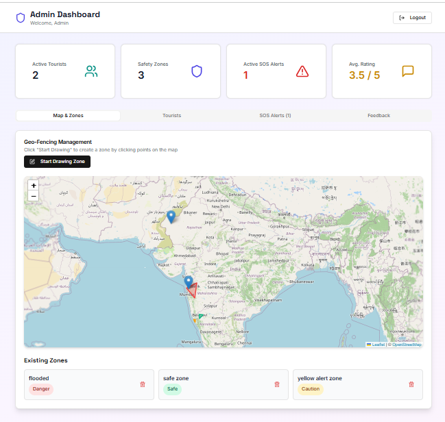
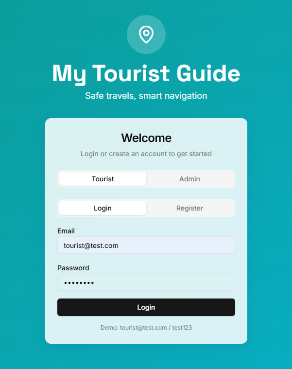

# 🧭 Tourist Safety Monitoring System

A full-stack web application for real-time tourist safety monitoring — featuring live geolocation tracking, an interactive map with admin-drawn safety zones, an SOS alert system, and a feedback/rating system. Built by a 4-member team.

## 📌 Overview

This platform helps monitor tourist safety through live location tracking, geofenced safety zones (safe/caution/danger), and an SOS alert system. Admins can draw custom zones directly on a map, respond to SOS alerts, and monitor active tourists in real time; tourists can search locations, share their live position, raise SOS alerts, check the weather, and leave feedback.

## ✨ Features

- **Authentication**: JWT-based login/registration with role-based access (tourist vs. admin), bcrypt password hashing
- **Live Geolocation Tracking**: Tourists' locations are tracked and updated automatically via the browser's geolocation API
- **Location Search**: Search any place by name using OpenStreetMap's Nominatim geocoding
- **Interactive Map**: Built with Leaflet and React-Leaflet, showing live tourist positions and safety zones
- **Admin Zone Drawing**: Admins can click points directly on the map to draw custom geofenced safety zones (safe/caution/danger)
- **SOS Alerts**: Tourists can raise an SOS alert with their live location and an optional message; admins can view and resolve active alerts in real time
- **Feedback System**: Star-rating feedback with comments; admins can view all submitted feedback and average ratings
- **Admin Dashboard**: Live stats (active tourists, zones, active SOS alerts, average rating), auto-refreshing every 10 seconds
- **Weather Display**: Shows current conditions for the tourist's location (currently placeholder data — live weather API integration planned)

## 🛠️ Tech Stack

| Layer | Technology |
|---|---|
| Frontend | React 19, React Router, Tailwind CSS, shadcn/ui, Leaflet / React-Leaflet |
| Backend | Python, FastAPI |
| Database | MongoDB (via Motor async driver) |
| Auth | JWT (python-jose), bcrypt password hashing (passlib) |
| Notifications | Sonner (toast notifications) |

## 🚀 How It Works

1. Users register/log in as either a tourist or admin; JWT tokens are issued on login.
2. Tourists' live location is tracked via the browser and sent to the backend, which also updates their most recent known position.
3. Tourists can search for any location by name, view live weather, and see safety zones on the map.
4. Tourists can raise an SOS alert at any time with their current location; admins see it appear live and can resolve it.
5. Admins can draw custom safety zones directly on the map by clicking points, then naming and categorizing the zone (safe/caution/danger).
6. Users can leave star-rating feedback; admins can review all feedback and see the average rating on their dashboard.

## 📄 My Contribution

- Worked on the front-end interface and core user workflow.
- Contributed to backend feature implementation and MongoDB integration.
- Helped debug and deploy the full application end-to-end (MongoDB Atlas setup, environment configuration, local dev environment).

## 🔮 Future Improvements

- Replace the placeholder weather response with a live weather API integration
- Add push/SMS notifications for SOS alerts and zone warnings
- Deploy to a live production environment

---
*This project was developed as a mini-project by a 4-member team at S. G. Balekundari Institute of Technology, Belagavi.*
